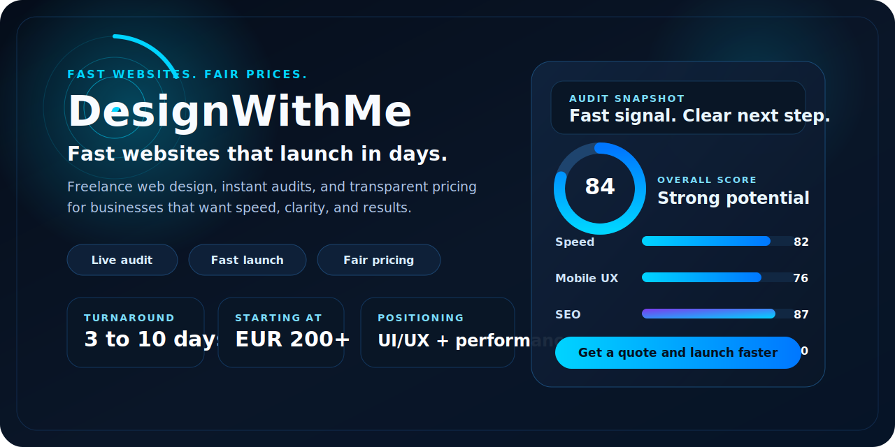
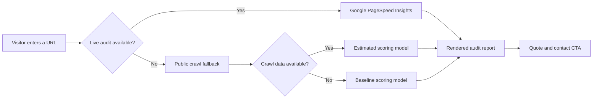

<p align="center">
  
</p>

<h1 align="center">DesignWithMe</h1>

<p align="center">
  Fast, conversion-focused websites and instant website audits for businesses that want to launch in days, not months.
</p>

<p align="center">
  <a href="https://designwithme.dev">Live Site</a>
  |
  <a href="mailto:stoyanbtanev@gmail.com">Email</a>
  |
  <a href="https://www.linkedin.com/in/stoyan-tanev-a732603b8/">LinkedIn</a>
  |
  <a href="https://github.com/stoyanbtanev">GitHub</a>
</p>

## Overview

DesignWithMe is the public-facing service site for Stoyan Tanev, a freelance web designer and developer based in Plovdiv, Bulgaria. This repository contains the full landing page experience for the service: brand positioning, a free instant website audit, transparent pricing, and a direct lead capture flow.

The project is built to communicate one message clearly: businesses should be able to get a sharp, modern website fast, without agency overhead, vague pricing, or slow delivery.

## At a Glance

| Focus | Details |
| --- | --- |
| Service | Freelance web design and development |
| Audience | Small businesses, founders, product launches, and redesign projects |
| Turnaround | 3 to 10 days |
| Starting price | EUR 200 |
| Positioning | Fast delivery, strong UI/UX, direct collaboration, fair pricing |
| Markets | Bulgaria and international clients |

## What This Site Does Well

- Presents a clear value proposition in the first screen
- Lets visitors run a free instant website audit directly from the hero section
- Shows structured service packages with transparent pricing
- Supports English and Bulgarian visitors with a built-in language toggle
- Offers light and dark themes with saved user preference
- Captures leads through an AJAX contact form with polished feedback states
- Reinforces trust with SEO metadata, structured data, and direct contact details

## Audit Experience

One of the strongest differentiators in this project is the audit flow. Instead of showing a static promise, DesignWithMe gives visitors immediate value by analyzing their site and using the result as a natural lead-in to a quote.

The audit engine is layered for resilience:

- Live audit via Google PageSpeed Insights when available
- Public crawl-based estimate as a secondary fallback
- Deterministic baseline scoring if external services are unavailable

That keeps the experience responsive while staying honest about the source of the results.



## Service Packages

| Package | Price | Best for | Includes |
| --- | --- | --- | --- |
| Quick Launch | EUR 200 | Events, launches, simple campaigns | 1 landing page, mobile-first design, basic SEO, contact form, 3-day delivery |
| Landing Page Pro | EUR 250 | Conversion-focused landing pages | 1 to 3 pages, premium motion, analytics, A/B test readiness, 5-day delivery |
| Website Revamp | EUR 500 | Rebuilding an existing website | Up to 5 pages, full redesign and rebuild, 90+ PageSpeed target, advanced SEO, 7-day delivery |
| New Website Build | EUR 800 | Full custom business websites | Up to 10 pages, custom design system, e-commerce ready foundation, support window, 10-day delivery |

## Why The Repo Feels Professional

- The project has a distinct brand voice instead of generic freelancer copy
- The landing page combines marketing, qualification, and lead generation in one flow
- Pricing is explicit, which reduces friction and signals confidence
- The codebase stays lightweight by using a single static entry point without framework overhead
- Design polish, motion, and SEO details support the premium-but-accessible positioning

## Technology

- HTML5 for the complete page structure
- Tailwind CSS via CDN for styling and layout
- Vanilla JavaScript for UI logic, language switching, theming, animations, and audit rendering
- Font Awesome for icons
- Google Fonts for typography
- Google PageSpeed Insights API for live audit data
- `r.jina.ai` fallback for crawl-based audit estimation
- FormSubmit AJAX endpoint for contact form delivery
- Schema.org JSON-LD for structured metadata

## Repository Structure

```text
.
|-- assets/
|   `-- repo-banner.svg
|-- index.html
|-- README.md
|-- .editorconfig
|-- .gitattributes
`-- .gitignore
```

## Contact

DesignWithMe is built and operated by Stoyan Tanev.

- Website: https://designwithme.dev
- Email: stoyanbtanev@gmail.com
- LinkedIn: https://www.linkedin.com/in/stoyan-tanev-a732603b8/
- GitHub: https://github.com/stoyanbtanev
